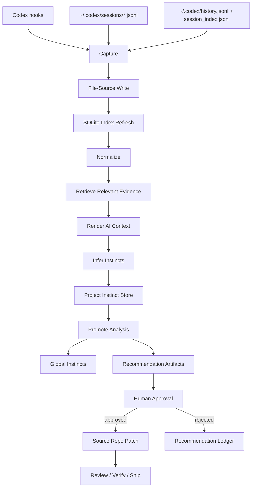
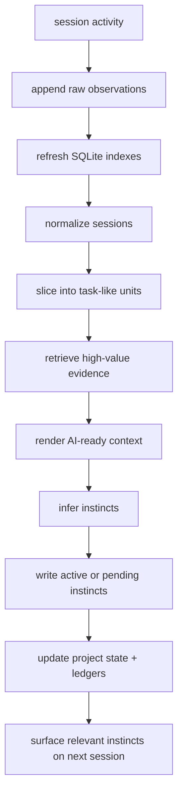
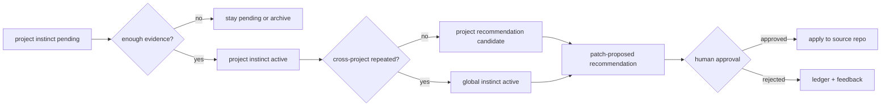

# Codex-Native 自动学习系统设计提案

这份提案描述一个只面向 `Codex` 的自动学习系统，用来替代“依赖 OpenSpace 作为学习中枢”的方案。

目标不是再引入一个新的自治平台，而是把自动学习能力直接建设在 `super-stack` 当前已经具备的能力之上：

- `Codex hooks`
- `~/.codex` 本地记录
- 现有 `codex-record-retrospective` 能力
- `skills / protocols / docs + harness` 的 source-repo-first 治理链

一句话概括：

`capture -> normalize -> infer -> promote -> apply`

其中：

- `capture` 负责采集行为证据
- `normalize` 负责把原始记录变成稳定 observation
- `infer` 负责从 observation 提炼 project-scoped instinct
- `promote` 负责把重复、高置信 instinct 升级为 global instinct 或 recommendation
- `apply` 负责在人工审批后把 recommendation 落到 `skills / protocols / docs`

## 为什么现在适合这样做

当前仓库已经有 3 个重要基础：

1. 已有 `codex-record-retrospective`，说明我们已经具备从 Codex 本地记录中做 retrospective 的能力。
2. 已有 `verify`、`review`、`ship` 的治理边界，说明我们已经有一条“不是只做执行，还要有证据与审批”的本地工作流。
3. 当前 OpenSpace 在本机上并没有成为稳定、自然、主路径的学习入口，因此继续围绕它建设学习系统的边际收益较低。

同时，ECC 的 `continuous-learning-v2` 提供了一个非常值得借鉴的方向：

- 通过 hooks 持续采集行为证据
- 不直接学习完整 skill，而是先学习原子 instinct
- 默认 project-scoped，避免跨项目污染
- 通过 confidence 和 promotion 把局部经验逐步升级为全局经验

对 `super-stack` 来说，最自然的做法不是复制 ECC 的 Claude 专用运行时，而是把它的设计思想重写成 `Codex-native` 版本。

## OpenSpace 可吸收的经验

虽然这套学习系统不再把 OpenSpace 当作前置依赖，但 OpenSpace 仍有 5 类经验值得保留：

1. `execution / recording / analysis` 分层
   - 采集、分析、治理不要混成一步
2. recording 是一等公民
   - recommendation 必须能回链到 observation 与 retrospective 证据
3. learning 不等于 auto-apply
   - 先形成 candidate，再审批，再落地
4. 重分析不要阻塞主任务
   - hooks 只做 capture，分析走异步或按需路径
5. 运行时上下文必须显式
   - `project_id`、`session_id`、`slice_id`、`stage` 都应该是硬字段

这份方案继承这些设计原则，但不继承 OpenSpace 那套额外运行时与委托中枢依赖。

## 设计目标

这个系统要解决 5 个问题：

1. 让 `Codex` 的行为证据能被持续采集，而不是只靠人工回忆复盘。
2. 让学习产物先以小粒度 instinct 存在，而不是一上来生成肥大的 skill。
3. 让学习默认按项目隔离，避免 React、Python、运维、文档类习惯互相污染。
4. 让高价值经验可以逐步升级成 recommendation，再进入人工审批链。
5. 让 learning system 本身是可审计、可验证、可回退的，而不是黑盒自改仓库。

## 非目标

这份提案明确不追求以下目标：

- 不追求跨宿主通用。第一阶段只服务 `Codex`。
- 不追求无人审批直接改仓库。
- 不追求把所有经验都升级成共享规则。
- 不追求一开始就实现 always-on 的复杂自治 agent 网络。
- 不追求取代现有 `review / verify / ship` 的治理职责。

## 核心设计原则

### 1. Codex First

- 记录源只围绕 `Codex` 设计。
- 输入优先使用 `Codex hooks` 与 `~/.codex/*` 本地记录。
- 不再为 Claude / OpenSpace / 其他宿主抽象而牺牲精度。

### 2. Project-Scoped by Default

- 新学习出的 instinct 默认是 `project` 范围。
- 只有在跨项目重复出现且证据足够强时，才允许提升为 `global`。

### 3. Atomic Before Composite

- 先产出 instinct，不直接产出 skill。
- instinct 是“一个触发条件 + 一个建议动作 + 一组证据 + 一个置信度”。
- skill、protocol 变更、AGENTS 优化都属于二阶产物。

### 4. Evidence Before Recommendation

- 没有 observation，不产 instinct。
- 没有重复 observation，不提升 confidence。
- 没有足够 confidence，不进入 recommendation。
- 没有人工批准，不改共享规则。

### 5. Source Repo First

- recommendation 的目标永远是 source repo。
- `~/.codex`、`~/.agents`、runtime copies 都只视为输入与运行产物，不是共享规则真源。

### 6. Runtime vs Durable Artifacts Separation

- 高频运行态数据放在 `~/.super-stack/learning/`。
- 可审计、可评审、值得导出的结果才进入仓库内 `artifacts/learning/`。
- 设计真源继续放在 `docs/` 与 `skills/.../references/`。

### 7. File-Source, SQLite-Index, AI-Render

- 文件是权威真源，负责保留 observation artifact、instinct artifact、recommendation artifact 与 ledger。
- `SQLite` 是派生索引层，负责筛选、去重、聚合、排序、增量处理。
- AI 最终消费的是文本化上下文，而不是直接面对原始 SQL rows。
- analyzer 应先通过索引层找出最相关证据，再回读文件真源，渲染成 prompt-ready context。

## 核心流程图

### 1. 系统总流程



### 2. 项目内运行态数据流



### 3. Instinct 晋升路径



## 存储策略

这套学习系统采用三层存储模型：

1. `文件真源层`
   - observation、normalized slice、instinct、recommendation、ledger 都以文件形式保留
   - 原因是它们更适合 AI 理解，也更适合人类审计与导出
2. `SQLite 索引层`
   - 用于 observation 索引、slice 关联、cross-project 聚合、promotion 候选筛选
   - 它是派生层，不是唯一真源；损坏时应能从文件重建
3. `AI 文本渲染层`
   - analyzer 先从 `SQLite` 找到最相关 evidence ids
   - 再回读文件真源，把证据渲染成面向 AI 的 Markdown / YAML / JSON context

这意味着：

- AI 更偏好文本化、带语义结构的 artifact
- 系统更偏好数据库做高效检索和聚合
- 最佳组合不是二选一，而是 `files for truth, SQLite for retrieval, rendered text for reasoning`

建议索引库位置：

```text
~/.super-stack/learning/index.db
```

建议 SQLite 只承担这些职责：

- observation 去重键与时间索引
- session / slice / project 关联
- instinct 索引与状态筛选
- cross-project promotion 聚合
- recommendation 去重与状态查询

建议继续保留为文件真源的内容：

- `observations.jsonl`
- `normalized/sessions/*` 与 `normalized/slices/*`
- `instincts/active|pending|archived/*`
- `recommendations/*`
- `ledgers/*.jsonl`

## 运行态目录边界

这套系统最终是一个持续运行的宿主级能力，而不是单仓库私有脚本集合。因此主运行态目录建议放在：

```text
~/.super-stack/learning/
```

原因：

- 它是 `super-stack` 的宿主级运行时，不应把高频数据写回任意一个项目仓库。
- 学习数据天然跨 session、跨 turn、跨项目存在。
- 高频 append、cache、lock、checkpoint 更适合 machine-local runtime 目录，而不是 repo 内目录。
- 这符合 `source repo first` 与 `runtime state separate` 的治理边界。

## 系统分层

### A. Capture

负责持续采集学习信号。

输入源建议分成 3 类：

1. `Codex hooks`
2. `~/.codex/sessions/*.jsonl`
3. `~/.codex/history.jsonl` / `session_index.jsonl`

其中：

- hooks 负责拿到最实时、最结构化的行为事件
- session JSONL 负责拿完整的会话轨迹与工具调用 chronology
- history / session_index 负责快速检索、路径关联、候选会话定位

建议采集的信号类型：

- `tool_start`
- `tool_complete`
- `user_correction`
- `verify_success`
- `verify_gap`
- `stage_transition`
- `backtrack`
- `task_outcome`

注意：

- capture 层只做轻量采集，不做重分析
- capture 层必须避免自循环，例如 learning analyzer 本身不应再被 capture
- capture 层不负责直接写共享规则

### B. Normalize

负责把杂乱的原始记录转成统一 observation schema。

建议 observation 结构：

```json
{
  "timestamp": "2026-03-31T10:00:00Z",
  "project_id": "abc123def456",
  "project_name": "super-stack",
  "session_id": "019d...",
  "slice_id": "slice-003",
  "event_type": "tool_complete",
  "stage": "verify",
  "tool": "mcp__chrome-devtools-mcp__take_snapshot",
  "summary": "Captured DOM snapshot from real webpage",
  "evidence_refs": [
    "session:019d...",
    "history:row-481"
  ],
  "metadata": {
    "cwd": "/Users/gclm/workspace/lab/ai/super-stack"
  }
}
```

这层的关键任务有两个：

1. `project attribution`
   - 通过 repo path / git remote / cwd，把 observation 正确归到项目
2. `session slicing`
   - 不把整条 session 天然视为一个任务，而是先切成 task-like slice

这一步会直接决定后续 instinct 精度。

### C. Infer

负责从 observation 中提炼 instinct。

instinct 不是完整 skill，而是小粒度学习单元。

建议 instinct schema：

```yaml
id: verify-before-claiming-done
scope: project
project_id: abc123def456
project_name: super-stack
trigger: when implementation appears complete but fresh proof is missing
action: run the narrowest verification path and separate 已实现 from 已验证
confidence: 0.78
domain: verify
source: codex-observation
occurrence_count: 6
last_seen: 2026-03-31
status: active
```

建议优先学习的 instinct 类型：

- `workflow`
  - 例如：先 `rg` 再读文件再编辑
- `verification`
  - 例如：浏览器任务至少拿 DOM / network / console 中的一项证据
- `routing`
  - 例如：用户明确要 findings-first 时进入 `review` 而不是直接 build
- `correction`
  - 例如：用户重复纠正“不要先问我要不要委托”
- `project convention`
  - 例如：这个项目里优先写 proposal，再改核心 routing

建议 confidence 先用简单、可解释的规则：

- 1-2 次：`0.3`
- 3-5 次：`0.5`
- 6-10 次：`0.7`
- 11+ 次：`0.85`

再叠加微调因子：

- 被 verify 成功支撑：`+0.05`
- 被用户明确否定：`-0.15`
- 长期未再出现：按周衰减

### D. Promote

负责把 instinct 从项目局部经验提升成更稳定的共享知识。

promotion 目标有两类：

1. `project -> global instinct`
2. `instinct -> recommendation artifact`

promotion 的基本门槛建议是：

- 在 2 个以上项目中独立出现
- 或在单项目中多次出现且 confidence 足够高
- 且其内容不是明显 project-specific noise

recommendation 目标建议限定为：

- `skills/...`
- `protocols/...`
- `docs/...`
- `codex/AGENTS.md`
- mapping / references / validators

不要直接把 instinct 自动写进共享入口文件。

### E. Apply

负责把 recommendation 进入 source repo 改动。

建议分 3 层：

1. `surface`
   - 在 session start / retrospective / verify 中提示高置信 instinct
2. `recommend`
   - 生成 patch-proposed recommendation artifact
3. `apply`
   - 只有在人工审批后，才真正改仓库文件

apply 仍应复用现有治理链：

- `review`
- `verify`
- `ship`

## 数据流

建议的主数据流：

```text
Codex hooks + ~/.codex records
  -> observation capture
  -> file-source write
  -> SQLite index refresh
  -> normalization + project attribution + session slicing
  -> retrieve relevant evidence from index.db
  -> read file-source artifacts
  -> render AI context
  -> instinct inference
  -> project instinct store
  -> promotion analysis
  -> global instinct or recommendation
  -> human approval
  -> source repo patch
  -> review / verify / ship
```

建议的日常运行流：

```text
session activity
  -> append observations
  -> periodic or on-demand analyzer
  -> update instincts
  -> session start surfaces relevant instincts next time
```

## 运行态目录结构

采用 `projects/<project-id>/...` 作为第一层边界，因为这个系统默认按项目隔离学习结果。

建议目录结构：

```text
~/.super-stack/learning/
  projects/
    <project-id>/
      project.json
      observations/
        observations.jsonl
        archive/
      normalized/
        sessions/
        slices/
      instincts/
        active/
        pending/
        archived/
      recommendations/
        pending/
        approved/
        rejected/
      state/
        analyzer.json
        checkpoints/
      locks/
  global/
    instincts/
      active/
      pending/
      archived/
    recommendations/
      pending/
      approved/
      rejected/
  ledgers/
    instinct-ledger.jsonl
    promotion-ledger.jsonl
    recommendation-ledger.jsonl
  registry/
    projects.json
  index.db
```

### 目录职责说明

- `projects/<project-id>/project.json`
  - 当前项目的元数据：`id`、`name`、`root`、`remote`、`created_at`、`last_seen`
- `projects/<project-id>/observations/`
  - 原始 observation，尽量 append-only
- `projects/<project-id>/normalized/sessions/`
  - session 级规整中间层
- `projects/<project-id>/normalized/slices/`
  - task-like slice 级规整中间层
- `projects/<project-id>/instincts/active/`
  - 当前有效的 project instinct
- `projects/<project-id>/instincts/pending/`
  - 低置信、待确认、等待更多证据的 instinct
- `projects/<project-id>/instincts/archived/`
  - 过期、被否定、或被 supersede 的 instinct
- `projects/<project-id>/recommendations/`
  - project-scoped recommendation 生命周期
- `projects/<project-id>/state/`
  - analyzer checkpoint、last processed marker、cooldown state
- `projects/<project-id>/locks/`
  - 防并发、防重入锁文件
- `global/`
  - 跨项目提升后的全局 instinct 与 recommendation
- `ledgers/`
  - 跨项目的长期账本，记录出现、提升、接受、拒绝
- `registry/projects.json`
  - 项目注册表，用于 project id 与 repo 元数据映射
- `index.db`
  - 派生索引层，用于高效检索、聚合、去重和 promotion 候选筛选

## 仓库内建议目录结构

仓库内仍保留设计真源和可导出的审计产物。

```text
docs/
  architecture/
    proposals/
      codex-native-learning-system.md

artifacts/
  learning/
    recommendations/
      YYYY-MM-DD-<topic>.json
      YYYY-MM-DD-<topic>.md
    ledgers/
      export-summary.json
      promotion-summary.json

skills/
  planning/
    codex-record-retrospective/
      SKILL.md
      scripts/
        find_codex_project_records.py
        extract_codex_session_timeline.py
        slice_codex_session.py
        build_observations.py
        infer_instincts.py
        promote_instincts.py
        surface_instincts.py
        process_retrospective.py
      references/
        artifact-schemas.md
        lesson-target-map.json
        instinct-domain-map.json
        observation-schema.json
        instinct-schema.md
        promotion-rules.md
```

### 仓库目录职责说明

- `docs/architecture/proposals/`
  - 设计与评审文档，不放高频运行态数据
- `artifacts/learning/`
  - 从运行态导出的审计级产物，不是主运行目录
- `skills/.../scripts/`
  - 规则执行与学习逻辑
- `skills/.../references/`
  - schema、mapping、promotion 规则

## 与现有能力的衔接

### 1. 与 `codex-record-retrospective` 的关系

它不是被替代，而是升级为自动学习系统的分析中枢之一。

建议演进方向：

- `find_codex_project_records.py`
  - 继续负责候选会话定位
- `extract_codex_session_timeline.py`
  - 继续负责 timeline 抽取
- `slice_codex_session.py`
  - 继续负责 slice 切分
- 新增 `build_observations.py`
  - 从 timeline / hooks / history 生成统一 observation
- 新增 `infer_instincts.py`
  - 从 observation 产 instinct
- 新增 `promote_instincts.py`
  - 从 instinct 产 promotion / recommendation
- 新增 `surface_instincts.py`
  - 在 session start / verify / retrospective 中 surfacing relevant instinct

### 2. 与 `verify` 的关系

`verify` 不负责自动学习，但会给 learning system 提供高价值信号：

- 哪些任务真的被 fresh evidence 证明过
- 哪些任务只是“已实现未验证”
- 哪些 recurring gaps 值得升级成 instinct

### 3. 与 `review` 的关系

`review` 能提供另一类高价值信号：

- 反复出现的 correctness risk
- 常见 regression pattern
- 缺失测试的重复类型

这些都可以转成 candidate instinct 或 recommendation。

### 4. 与 OpenSpace 的关系

在这套设计里，OpenSpace 不再是前置依赖。

如果未来仍保留 OpenSpace，它最多是：

- 一个外部委托执行器
- 一个可选实验后端

但 learning system 自身不应该建立在 OpenSpace 是否可用之上。

## Phase 规划

### Phase 1: Observation + Instinct

目标：先把 learning system 从 0 做到可见、可读、可审计。

交付：

- observation schema
- instinct schema
- `build_observations.py`
- `infer_instincts.py`
- project-scoped instinct store in `~/.super-stack/learning/projects/<project-id>/instincts/`
- 最小 `index.db` 索引刷新逻辑
- `status` / `surface` 基础输出

这阶段不做自动 apply。

### Phase 2: Precision Upgrade

目标：把“精度不够”作为第一优先级优化对象。

交付：

- 更强的 session -> slice 评分
- correction detection
- verify gap detection
- recommendation 候选的 evidence ranking
- cross-project promotion 索引查询

### Phase 3: Promotion + Surface

目标：让学习结果开始改善日常体验。

交付：

- project/global promotion
- session start surfacing
- retrospective / verify 中展示高置信 instinct

### Phase 4: Recommendation + Apply

目标：让 learning system 进入 source repo 改进闭环。

交付：

- recommendation artifact
- approval gate
- minimal patch generation
- review / verify / ship 集成

## 风险与保护措施

### 风险 1：学习结果变成噪音堆积

保护：

- 默认 project-scoped
- confidence gate
- pending TTL
- promotion ledger
- archive / prune

### 风险 2：自动学习污染共享规则

保护：

- 不允许直接改共享规则
- 只产 recommendation
- apply 必须人工审批

### 风险 3：自动学习反向影响主任务

保护：

- capture 轻量化
- analysis 异步 / 定时 / 手动触发
- analyzer 自己不再被 observation capture

### 风险 4：skill 入口再次膨胀

保护：

- schema / map / rules 优先放到 `references/`
- `SKILL.md` 只保留触发与边界
- 先改脚本和 mapping，再考虑改入口文案

### 风险 5：索引层反客为主

保护：

- SQLite 只做派生索引，不做唯一真源
- recommendation 与 instinct 的最终审计链仍回指文件真源
- `index.db` 损坏时应能从文件重建

## 决策建议

基于当前仓库状态，推荐做如下决策：

1. 不再把 OpenSpace 作为自动学习系统的必要前置条件。
2. 自动学习系统只围绕 `Codex` 建设，优先做 `Codex-native` 精度。
3. 默认采用 `project-scoped instinct`，而不是直接生成共享 skill。
4. recommendation 继续通过现有 source repo 治理链落地。
5. 第一阶段先做 observation + instinct，不急着做自动 apply。
6. 高频运行态目录固定放在 `~/.super-stack/learning/`。
7. 存储策略采用 `文件真源 + SQLite 索引层 + AI 文本渲染层`。

## 下一步建议

最自然的下一步实现顺序是：

1. 固化 observation schema 与 instinct schema
2. 实现 `build_observations.py`
3. 实现最小 `index.db` 索引刷新器
4. 实现 `infer_instincts.py`
5. 为 instinct / observation 增加最小测试集
6. 再决定 session-start surfacing 的注入方式

如果这份提案被接受，建议接下来把它转成一组最小、可验证的 Phase 1 任务，而不是一次性大改。
